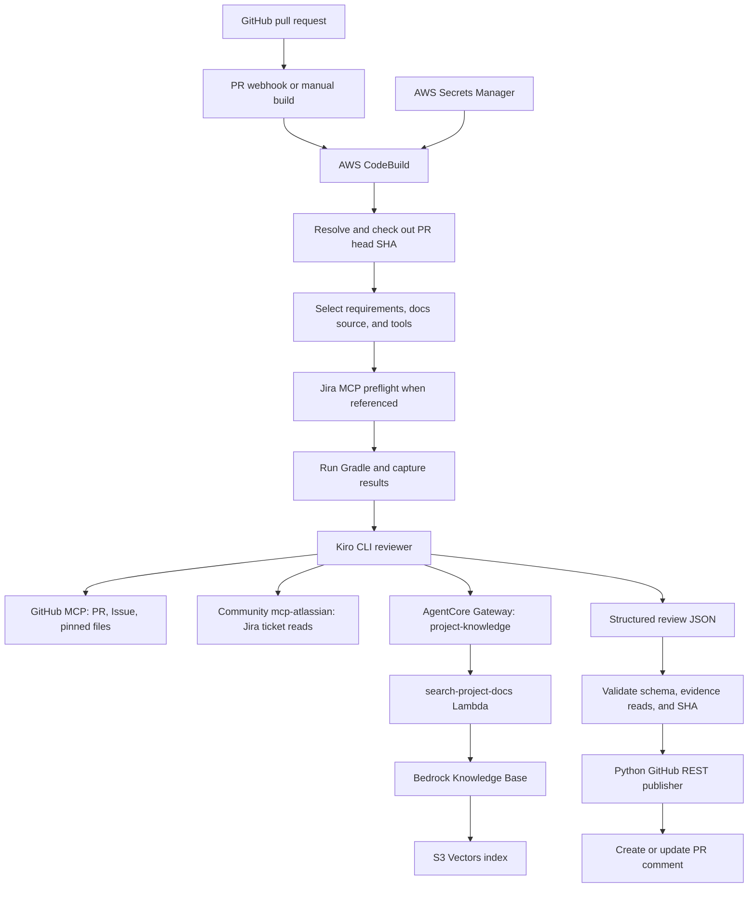
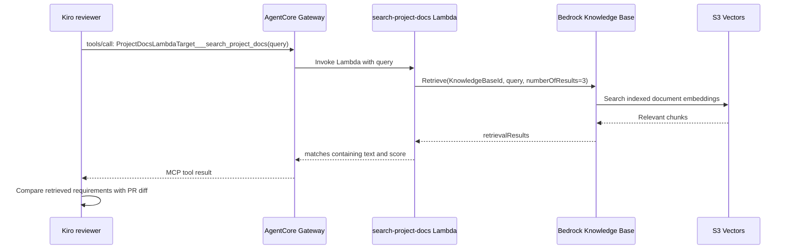

# AI PR Reviewer POC

**An end-to-end pull request reviewer that compares code changes with real acceptance criteria, project documentation, and actual build results.**

AWS CodeBuild runs the application checks and Kiro reviewer. Kiro reads evidence through approved MCP tools and returns structured JSON. A separate Python publisher validates that output, checks that the PR still points to the reviewed commit, and creates or updates a GitHub comment through the REST API.

The POC supports two demonstrated paths:

| Project | Acceptance criteria | Documentation | Application validation |
| --- | --- | --- | --- |
| Customer Preferences service in this repository | Linked GitHub Issue; Jira when referenced | Existing Bedrock Knowledge Base through AgentCore Gateway | `gradle clean build` |
| Apache Fineract fork | Jira ticket `SCRUM-5` | Existing Fineract files through GitHub MCP at the reviewed commit | Focused `StringUtilTest` Gradle task |

**Verified:** the Fineract run read Jira headlessly inside CodeBuild, detected the intentional acceptance-criteria violation, validated its JSON, and [published a `NEEDS_CHANGES` review](https://github.com/pranaypolishetti26/fineract/pull/1#issuecomment-6099756030). Its CodeBuild result is correctly red because two fixture tests intentionally fail.

This README describes the implementation on `feat/fineract-jira-review`, including the infrastructure in the AWS learning repository, whose GitHub name is [`pranaypolishetti26/aws-practice`](https://github.com/pranaypolishetti26/aws-practice). Resource settings and live results were checked on October 10, 2026. Resource identifiers below are configuration values, not credentials.

## Contents

- [Architecture and responsibilities](#architecture-and-responsibilities)
- [Repository map](#repository-map)
- [The end-to-end review flow](#the-end-to-end-review-flow)
- [Choosing acceptance criteria and documentation](#choosing-acceptance-criteria-and-documentation)
- [How Jira tickets are read](#how-jira-tickets-are-read)
- [How project documentation is read](#how-project-documentation-is-read)
- [The AWS learning repository and AgentCore Gateway](#the-aws-learning-repository-and-agentcore-gateway)
- [Secrets, authentication, and permissions](#secrets-authentication-and-permissions)
- [Setup and running a review](#setup-and-running-a-review)
- [Structured output and publication](#structured-output-and-publication)
- [Observability and troubleshooting](#observability-and-troubleshooting)
- [Verified demonstrations](#verified-demonstrations)
- [Local tests and review-quality evaluation](#local-tests-and-review-quality-evaluation)
- [Costs and current limitations](#costs-and-current-limitations)

## Architecture and responsibilities



The context selects which documentation connection is active. Fineract uses GitHub repository files and disables `project-knowledge`; the original service uses the Knowledge Base. Jira is enabled only when ticket keys are present.

| Component | Responsibility |
| --- | --- |
| GitHub | Hosts the application, PR diff, Issues, and published review comment |
| CodeBuild | Executes the workflow, pins application code, runs Gradle, launches Kiro, and invokes validation/publishing |
| Kiro CLI | Reasons about the evidence and produces the review; it does not run tests or publish comments |
| GitHub MCP | Provides read access to PR details/diffs, linked Issues, and repository documentation |
| Community `mcp-atlassian` | Runs as a local subprocess and reads Jira through its REST API |
| AgentCore Gateway | Exposes the documentation Lambda as an MCP tool |
| Documentation Lambda | Converts a query into a Bedrock Knowledge Base `Retrieve` request |
| Bedrock Knowledge Base | Retrieves relevant indexed documentation chunks |
| Secrets Manager | Stores Kiro, GitHub, and Jira credentials |
| Python publisher | Enforces the output contract and writes the GitHub comment using REST |

AgentCore Gateway is the documentation tool endpoint in this workflow. **Kiro running in CodeBuild is the reviewer.** This POC does not deploy the reviewer as an AgentCore Runtime or use the gateway to choose its review model.

## Repository map

```text
pr-reviewer-poc/
├── README.md
├── buildspec.yml                     # CodeBuild orchestration
├── .kiro/
│   ├── agents/pr-reviewer.json        # Tool allowlist and permission rules
│   ├── agents/pr-reviewer-prompt.md   # Review instructions and JSON contract
│   └── settings/mcp.json             # GitHub, gateway, optional Jira connections
├── scripts/
│   ├── prepare_review_context.py     # PR routing, conditional secrets, runtime config
│   ├── probe_jira_mcp.py              # Noninteractive MCP access check
│   ├── publish_pr_review.py           # Stream extraction, validation, SHA checks, REST
│   ├── sync_knowledge_base.py         # Separate merged-document sync workflow
│   └── evaluate_reviews.py           # Offline review-quality rubric
├── .github/workflows/
│   └── sync-knowledge-base.yml        # Main-branch document synchronization
├── docs/
│   ├── knowledge-base/               # Original service requirements and architecture
│   ├── knowledge-base-sync.md        # Sync IAM/configuration details
│   └── live-e2e-results.md            # Earlier GitHub Issue/Knowledge Base live results
├── demo/                             # Intentional evaluation fixtures and patches
├── evals/                            # Rubrics, example reviews, captured observation
├── tests/                            # Python workflow/validation checks
└── src/                              # Java Customer Preferences service and tests
```

The Fineract application lives in a [separate fork](https://github.com/pranaypolishetti26/fineract), rather than being copied into this repository. The gateway infrastructure lives in `aws-practice/PRReviewAgentcore`.

## The end-to-end review flow

1. **Receive a trigger.** A PR webhook supplies `CODEBUILD_WEBHOOK_TRIGGER=pr/<number>`. A manual run can instead provide a positive integer `PR_NUMBER` override. `GITHUB_REPOSITORY` must be `owner/repo`, not a GitHub URL.
2. **Load workflow credentials.** CodeBuild resolves `KIRO_API_KEY` and `GITHUB_PERSONAL_ACCESS_TOKEN` from the existing Secrets Manager secret. `GITHUB_TOKEN` is exported from that PAT for GitHub MCP.
3. **Preserve the reviewer implementation.** The agent, prompt, and MCP settings are copied to Kiro's configuration directory. The Python helpers are copied to `/tmp` before switching the application checkout.
4. **Resolve the PR head.** The publisher's `--head-sha` mode reads the PR through GitHub REST and saves its exact commit SHA.
5. **Prepare trusted context.** `prepare_review_context.py` reads the PR again, verifies its head has not changed, extracts Jira references, detects GitHub Issue references, and selects the documentation source and build command. It writes `/tmp/pr-reviewer-context.json`.
6. **Configure only the required tools.** The helper rewrites the runtime MCP and agent settings. Jira credentials are fetched only for Jira-linked reviews. The generated MCP file has mode `0600`.
7. **Probe Jira before expensive work.** When Jira is needed, the workflow installs pinned `uv` and starts the community server. The probe initializes MCP, verifies that only `jira_get_issue` is exposed, and reads the first referenced ticket with a nonempty description. Failure stops the build before Gradle and AI review.
8. **Check out the application SHA.** CodeBuild fetches and checks out the saved head, then verifies `git rev-parse HEAD`. Fineract gets a separate checkout in `/tmp/pr-reviewer-application`, including tags and `develop` history needed for version calculation.
9. **Run the selected Gradle task.** Output is captured in `/tmp/pr-reviewer-gradle.log`. A failure is recorded rather than immediately stopping the review. For Fineract, the existing CI memory-budget script applies `MAX_HEAP=2g` and `WORKERS_MAX=1`.
10. **Run Kiro outside the application checkout.** CodeBuild supplies the context, head SHA, exact command, exit code, and captured build output through stdin. Kiro reads PR evidence, requirements, and documentation through MCP.
11. **Extract and validate the review.** The Python helper extracts the final JSON from Kiro's ACP stream, checks required successful reads, validates the schema and build status, and verifies the review SHA.
12. **Publish through REST.** The publisher discovers its existing marked comment, rechecks the live PR head immediately before the write, and creates or updates the comment. A failed Gradle task still causes CodeBuild to exit nonzero after a valid review is published.

The Kiro invocation is:

```sh
kiro-cli chat \
  --agent pr-reviewer \
  --agent-engine v3 \
  --no-interactive \
  --require-mcp-startup \
  --output-format stream-json
```

The workflow uses explicit tool permissions rather than blanket trust. Kiro is denied built-in shell/file tools and unapproved MCP tools. Running it outside the application checkout prevents that checkout's agent overrides and hooks from being loaded.

## Choosing acceptance criteria and documentation

`prepare_review_context.py` determines these choices before the review. PR text supplies references, but cannot choose an arbitrary MCP endpoint or documentation backend.

| Condition | Requirements behavior | Documentation behavior |
| --- | --- | --- |
| Jira keys in PR title or body | Read every referenced Jira key through `jira_get_issue` | Select source according to the repository |
| No Jira keys, linked GitHub Issue | Read the linked Issue with `issue_read` | Select source according to the repository |
| No Jira keys and no linked Issue | Explain that acceptance criteria could not be verified; use alignment `UNVERIFIED` | Still read project documentation |
| Repository equals `pranaypolishetti26/fineract` | Apply the requirements rules above | Read all four Fineract documentation paths at the pinned SHA; disable Knowledge Base MCP |
| Other repository | Apply the requirements rules above | Use the existing Knowledge Base tool |

Jira keys are extracted from the **PR title and body**, deduplicated, and sorted using a pattern such as `SCRUM-5` or `BANK-12`. Branch names and commit messages are not scanned. All keys are resolved against the configured test Jira site; the reviewer does not follow arbitrary Jira hosts from PR text.

An example Fineract context is:

```json
{
  "head_sha": "c9eba66dc5f64e3ff6a8f4bcec2e77c99e538f8e",
  "jira_keys": ["SCRUM-5"],
  "jira_site": "https://pranaypspk26.atlassian.net",
  "github_issue_linked": false,
  "documentation_source": "repository",
  "documentation_paths": ["README.md", "CONTRIBUTING.md", "AGENTS.md", "SECURITY.md"],
  "build_command": "./gradlew --no-daemon --console=plain :fineract-core:test --tests org.apache.fineract.infrastructure.core.service.StringUtilTest"
}
```

The Fineract routing is deliberately specific to this fixture. Before onboarding another project, add an appropriate repository/documentation/build policy in `context_for`; the default Knowledge Base contains Customer Preferences documentation and should not be treated as evidence for an unrelated application.

## How Jira tickets are read

### The current server

The reviewer uses the open-source [community `mcp-atlassian` server](https://github.com/sooperset/mcp-atlassian). CodeBuild launches it through `uvx` as a stdio subprocess:

```text
uvx --python 3.12 mcp-atlassian==0.23.1
```

`uv==0.13.0` is installed only for Jira-linked builds. The runtime server configuration supplies:

| Environment variable | Purpose |
| --- | --- |
| `JIRA_URL` | Scoped-token REST gateway: `https://api.atlassian.com/ex/jira/888ba0e5-a89b-430c-ae7b-9d9c22c629d0` |
| `JIRA_USERNAME` | Token owner's Atlassian email, supplied from `JIRA_EMAIL` |
| `JIRA_API_TOKEN` | Raw token resolved from Secrets Manager |
| `READ_ONLY_MODE=true` | Disables write operations |
| `ENABLED_TOOLS=jira_get_issue` | Exposes only the ticket read tool |
| `MCP_VERBOSE=false`, `MCP_VERY_VERBOSE=false` | Avoids verbose server diagnostics |

The account used in the verified test is `pranaypspk26@gmail.com`. For another Jira site, update both the human-facing `JIRA_SITE` and the API gateway cloud ID, as well as the corresponding static MCP template.

For each ticket, Kiro requests:

```json
{
  "issue_key": "SCRUM-5",
  "fields": "summary,description,status",
  "comment_limit": 0,
  "update_history": false
}
```

Acceptance criteria are in the ticket description. The reviewer is not currently configured to read separate custom acceptance-criteria fields or ticket comments. Disabling view-history updates keeps this request from changing the ticket's view history.

### Community server versus official Atlassian MCP

These are different servers with different authentication requirements:

| | Community server used here | Official hosted Atlassian Rovo MCP |
| --- | --- | --- |
| Connection | Local `uvx` subprocess | `https://mcp.atlassian.com/v2/mcp` |
| Jira access | Jira REST API | Atlassian's hosted MCP service |
| Read tool | `jira_get_issue` | `getJiraIssue` |
| Token permissions | Jira REST read scopes, with `read:jira-work` verified for this fixture | MCP `agent-interface` scopes |
| Rovo MCP admin enablement | Not needed for this REST-based connection | Required for API-token connections to the hosted service |

The earlier official-server attempt authenticated far enough to discover resources but was blocked by organization permission for API-token MCP connections. The community integration subsequently received a REST scope error until the token was updated. **The final community-server configuration passed locally and in headless CodeBuild.** See [Atlassian's official-server authentication guide](https://developer.atlassian.com/cloud/rovo-mcp/guides/configuring-authentication-via-api-token/) for the separate hosted-service requirements.

When no Jira key exists, runtime setup removes the Jira server, does not fetch its secret, and the probe reports `SKIPPED`. A Jira authentication failure never silently switches a Jira-linked review to GitHub-only evidence.

## How project documentation is read

### Path A: Bedrock Knowledge Base through AgentCore Gateway

The original Customer Preferences service has requirements, architecture, and test guidance in `docs/knowledge-base/`. Their merged versions are indexed in an existing Knowledge Base.



The configured MCP connection is named `project-knowledge`, at:

```text
https://prreviewagentcore-prreviewgateway-6tdiyooexa.gateway.bedrock-agentcore.us-east-2.amazonaws.com/mcp
```

Its approved tool is `ProjectDocsLambdaTarget___search_project_docs`. The gateway routes that tool to the existing `search-project-docs` Lambda. The deployed handler:

- Takes `event["query"]` as the search text.
- Reads `KNOWLEDGE_BASE_ID` from its environment; the current value is `UW6ENMRRLS`.
- Calls `boto3.client("bedrock-agent-runtime", region_name="us-east-2").retrieve(...)`.
- Requests up to three vector-search results.
- Returns `{"matches": [{"text": "...", "score": 0.0}]}`.

The current Knowledge Base uses Titan Text Embeddings V2 (`amazon.titan-embed-text-v2:0`), 1,024-dimensional float embeddings, and an S3 Vectors index. The source documents remain in the S3 data source; ingestion creates the searchable representation. This distinction between ingestion and retrieval is described in [AWS's Knowledge Base overview](https://docs.aws.amazon.com/bedrock/latest/userguide/kb-how-it-works.html).

The Lambda returns retrieved text and scores, rather than a generated review. Kiro supplies the reasoning. Its current response omits the retrieval result's source location, and retrieval is not pinned to the PR's documentation snapshot. Evidence citations are therefore less precise than the Fineract repository-file path.

### Path B: Pinned repository files for Fineract

Fineract reviews read `README.md`, `CONTRIBUTING.md`, `AGENTS.md`, and `SECURITY.md` through GitHub MCP's `get_file_contents`, using the reviewed commit SHA. Relevant additional file reads must use that SHA too.

The validator requires a successful read of every configured path with the exact head SHA. It accepts the tool's `sha` parameter or a matching `ref`; when `sha` is supplied, it takes precedence. A correct `ref` cannot hide an incorrect `sha`.

For this path, runtime setup disables `project-knowledge` and excludes its tool from the agent's permissions. Extraction also rejects a completed Knowledge Base search in a repository-documentation review. Customer Management or Customer Preferences documents are not Fineract evidence.

No Fineract documentation is created, regenerated, uploaded, or ingested by the review workflow.

### The separate document synchronization workflow

The existing `.github/workflows/sync-knowledge-base.yml` workflow maintains the **original service's** Knowledge Base. It is separate from PR review:

1. A push to `main` changes `docs/knowledge-base/**`.
2. GitHub Actions checks out the latest `main` and assumes the dedicated sync IAM role through OIDC.
3. `sync_knowledge_base.py` checks that the existing Bedrock S3 data source matches the configured bucket and prefix.
4. `aws s3 sync --delete --no-follow-symlinks` mirrors that dedicated document prefix.
5. The script starts ingestion, polls until `COMPLETE`, and fails on ingestion errors or failed documents.

Runs are serialized without cancelling active ingestion. Both workflow and script reject PR/feature-branch events. The script handles deletion of the last document through an empty source directory.

| Setting | Existing default |
| --- | --- |
| Region | `us-east-2` |
| Source bucket | `project-docs-018724218019-us-east-2-an` |
| Document prefix | `customer-preferences-service/` |
| Knowledge Base | `UW6ENMRRLS` |
| Data source | `5H1O8QTP3N` |
| OIDC sync role | `arn:aws:iam::018724218019:role/pr-reviewer-docs-sync` |

The prefix is owned by the repository documents: `--delete` removes remote objects absent locally. Configuration and IAM details are in [the sync guide](docs/knowledge-base-sync.md).

Editing this root README does not match the document-sync path filter. Writing this README does not upload or synchronize any S3/Knowledge Base content.

## The AWS learning repository and AgentCore Gateway

The infrastructure side is in [`aws-practice/PRReviewAgentcore`](https://github.com/pranaypolishetti26/aws-practice/tree/main/PRReviewAgentcore).

| Infrastructure file | Role |
| --- | --- |
| [`agentcore/agentcore.json`](https://github.com/pranaypolishetti26/aws-practice/blob/main/PRReviewAgentcore/agentcore/agentcore.json) | Project resource specification and gateway/target declarations |
| [`agentcore/aws-targets.json`](https://github.com/pranaypolishetti26/aws-practice/blob/main/PRReviewAgentcore/agentcore/aws-targets.json) | Deployment account and region |
| [`agentcore/cdk/bin/cdk.ts`](https://github.com/pranaypolishetti26/aws-practice/blob/main/PRReviewAgentcore/agentcore/cdk/bin/cdk.ts) | Reads configuration and creates a stack for each deployment target |
| [`agentcore/cdk/lib/cdk-stack.ts`](https://github.com/pranaypolishetti26/aws-practice/blob/main/PRReviewAgentcore/agentcore/cdk/lib/cdk-stack.ts) | Instantiates `AgentCoreApplication` and `AgentCoreMcp` constructs |
| [`tools.json`](https://github.com/pranaypolishetti26/aws-practice/blob/main/PRReviewAgentcore/tools.json) | Schema for the original `get_pull_request(pr_number)` Lambda tool |
| `agentcore/.cli/deployed-state.json` | Recorded gateway endpoint, target IDs, and stack state |

The project was generated with the AgentCore CLI and uses AWS CDK, including `@aws/agentcore-cdk`. Its deployment target is account `018724218019`, region `us-east-2`, and stack `AgentCore-PRReviewAgentcore-default`.

The saved project has empty runtime, memory, Knowledge Base, and evaluator arrays. It references an existing Lambda for its gateway target; it does not declare the current documentation Knowledge Base as a managed resource.

### Saved configuration versus live gateway

The saved JSON and deployed-state file record only `PullRequestLambdaTarget`. The live gateway also has a documentation target:

| Live target | Lambda | Current reviewer usage |
| --- | --- | --- |
| `ProjectDocsLambdaTarget` | `search-project-docs` | Enabled for original-service documentation retrieval |
| `PullRequestLambdaTarget` | `get-pull-request` | Disabled in reviewer MCP settings; real PR data comes from GitHub MCP |

The public tool name combines the target and tool names: `ProjectDocsLambdaTarget___search_project_docs`. AgentCore converts Lambda targets into MCP-compatible tools; see [AWS's gateway documentation](https://docs.aws.amazon.com/bedrock-agentcore/latest/devguide/gateway.html).

**The infrastructure repository does not currently contain a complete declaration of the live documentation path.** A fresh deployment from its saved config alone should not be assumed to reproduce the documentation target, Lambda, Knowledge Base, or index. Reconcile those existing resources with the source configuration before redeploying; the README update does not change them.

The repository also contains learning scripts such as `pr_agent.py` and `retrieve_kb.py`. `pr_agent.py` demonstrates a separate Nova Micro tool-use loop and references an older Knowledge Base ID, `KOOM8AP06E`. Those scripts are experiments, not the active CodeBuild/Kiro orchestration or the current `UW6ENMRRLS` retrieval path.

### Infrastructure inspection and deployment

Existing resources can be inspected without deploying:

```sh
aws bedrock-agentcore-control get-gateway \
  --gateway-identifier prreviewagentcore-prreviewgateway-6tdiyooexa \
  --region us-east-2

aws bedrock-agentcore-control list-gateway-targets \
  --gateway-identifier prreviewagentcore-prreviewgateway-6tdiyooexa \
  --region us-east-2

aws bedrock-agent get-knowledge-base \
  --knowledge-base-id UW6ENMRRLS \
  --region us-east-2
```

For infrastructure development, the generated project documents Node.js 20+, AWS credentials, and the AgentCore CLI. Its normal lifecycle includes `agentcore validate`, `agentcore status`, and `agentcore deploy`. Deployment is an infrastructure-changing operation, not a prerequisite for each review. Reuse the existing ready gateway for this POC rather than creating another one.

The live gateway currently uses authorizer type `NONE`, consistent with the saved specification. The documentation Lambda currently has a three-second timeout and a broad `PowerUserRole`. These are POC settings, not a production authentication or least-privilege design. Kiro's read-tool restrictions do not authenticate other callers to that gateway.

## Secrets, authentication, and permissions

### Secrets Manager

The existing secret is `poc/kiro-pr-reviewer` in `us-east-2`. Its intended JSON shape is:

```json
{
  "KIRO_API_KEY": "<Kiro API key>",
  "GITHUB_PERSONAL_ACCESS_TOKEN": "<GitHub PAT>",
  "JIRA_API_TOKEN": "<raw Atlassian scoped API token>"
}
```

Keep real values in Secrets Manager. The runtime Jira helper supports these keys in precedence order:

1. `JIRA_API_TOKEN`: raw token, preferred for new configuration.
2. `JIRA_TOKEN`: raw token, retained for compatibility.
3. `JIRA_BASIC_AUTH`: either a raw token or base64-encoded `email:token`, optionally prefixed by `Basic `.

The verified setup uses the compatible `JIRA_BASIC_AUTH` key. When an encoded value supplies an email, it must match `JIRA_EMAIL`. If more than one supported key exists, updating only a lower-priority key will not replace the selected credential.

The community server ultimately receives a raw `JIRA_API_TOKEN`; it does not receive a Basic authorization header from `mcp.json`. The older hosted-server `JIRA_BASIC_AUTH` placeholder is no longer the connection mechanism.

### Environment variables

| Variable | Source and meaning |
| --- | --- |
| `KIRO_API_KEY` | Secrets Manager mapping in `buildspec.yml` |
| `GITHUB_PERSONAL_ACCESS_TOKEN` | Secrets Manager mapping; used for REST and Git authentication |
| `GITHUB_TOKEN` | Exported from that PAT for GitHub MCP |
| `GITHUB_REPOSITORY` | `owner/repo`; default is this POC repository, overridable for the Fineract run |
| `PR_NUMBER` | Webhook-derived or trusted manual override |
| `JIRA_EMAIL` | Plaintext token-owner email configured in the buildspec |
| `PR_HEAD_SHA` | Resolved by the workflow, not supplied by the PR |
| `REVIEW_BUILD_COMMAND` | Selected by the context helper, not taken from the PR |
| `REVIEW_CONTEXT_PATH` | Generated context file path |
| `JIRA_PROBE_ISSUE` | First referenced key selected by the workflow |
| `GRADLE_EXIT_CODE` | Actual application-check result |

`.env.example` is a small local template, not a complete CodeBuild/Jira configuration. Do not commit filled-in credentials.

### Permissions by actor

| Actor | Required access |
| --- | --- |
| CodeBuild service role | Read the existing secret; write its build logs; any required KMS decrypt permission for the secret's key |
| GitHub PAT | Repository contents and PR/Issue reads; Issues write for the issue-comment publisher; access to both POC and fork as applicable |
| Atlassian token owner | Jira site/project permission to view the referenced ticket, plus REST scopes covering the requested fields |
| AgentCore gateway execution role | Invoke the configured Lambda targets |
| Documentation Lambda execution role | Bedrock retrieval for the configured Knowledge Base and appropriate logging permissions |
| GitHub Actions docs-sync role | OIDC trust for this repository's `main`; scoped S3 synchronization and Bedrock ingestion permissions |
| Kiro reviewer | Only the context-specific MCP read tools; no built-in shell/file or GitHub publishing tool |

The docs-sync role is separate from CodeBuild's role. Bedrock retrieval uses the Lambda's AWS identity, not the Jira or GitHub token. GitHub API authentication and the connected GitHub app used during setup are also separate identities; success through one does not prove that the stored PAT can publish.

## Setup and running a review

### Prerequisites

- Access to this repository and the existing AWS resources in `us-east-2`.
- A working CodeBuild GitHub source connection/webhook for the original repository.
- Valid Kiro and GitHub credentials in `poc/kiro-pr-reviewer`.
- For Jira-linked reviews, a scoped Atlassian token and its matching account email.
- Python for the workflow helpers; network access to GitHub, Kiro, package downloads, and the selected documentation/Jira endpoints.
- Java 21 and Gradle for the original service. The verified CodeBuild image also provides Java 25 for Fineract, which uses its Gradle wrapper.

The existing CodeBuild project is `kiro-pr-review-poc`, with source `pranaypolishetti26/pr-reviewer-poc`, buildspec `buildspec.yml`, Amazon Linux standard image `6.0`, and `BUILD_GENERAL1_MEDIUM` compute. It uses no build artifacts for these reviews.

Use a workflow source revision containing the Jira/Fineract changes. The verified reviewer revision is `0699592ac13b721db3a958a1f7aab27e4e002d48`; do not assume the default branch already contains the feature branch.

### Original repository: webhook path

Create a feature PR and reference its GitHub Issue in the title/body, for example `Implements #5`. An existing PR webhook triggers CodeBuild. With no Jira key, the Jira connection is removed and the existing Issue plus Knowledge Base review path is used.

The historical [demo steps](demo/DEMO-STEPS.md) describe the original fixture. Their initial bucket/Knowledge Base setup is already complete in the existing environment; it is not necessary to recreate or re-ingest infrastructure for every review.

### Fineract: manual run on the existing project

The Fineract draft [PR #1](https://github.com/pranaypolishetti26/fineract/pull/1) references [SCRUM-5](https://pranaypspk26.atlassian.net/browse/SCRUM-5). The existing project can review it through overrides, without adding another CodeBuild project or fork webhook:

```sh
aws codebuild start-build \
  --project-name kiro-pr-review-poc \
  --source-version 0699592ac13b721db3a958a1f7aab27e4e002d48 \
  --environment-variables-override \
    name=GITHUB_REPOSITORY,value=pranaypolishetti26/fineract,type=PLAINTEXT \
    name=PR_NUMBER,value=1,type=PLAINTEXT \
  --timeout-in-minutes-override 15 \
  --region us-east-2 \
  --query build.id \
  --output text
```

This command starts a billable build and can publish a comment. `--source-version` selects the **reviewer workflow revision** in this repository. The application **PR head SHA** is fetched separately from the Fineract PR and pinned by the workflow. A manual override does not permanently change the project configuration.

The Fineract command is:

```sh
./gradlew --no-daemon --console=plain \
  :fineract-core:test \
  --tests org.apache.fineract.infrastructure.core.service.StringUtilTest
```

This is a fixture-specific focused task, not a full Fineract build or integration test suite. Fineract history/tags and its existing memory-budget helper are used because shallow history and oversized default heap settings caused earlier setup failures.

### Checking Jira access before a full run

`probe_jira_mcp.py` expects the **prepared runtime configuration**, containing resolved credentials and an enabled Jira server. Running it against the checked-in template is not equivalent: the template has placeholders and Jira is disabled by default.

After preparing a runtime config in a controlled environment:

```sh
JIRA_PROBE_ISSUE=SCRUM-5 \
  python3 scripts/probe_jira_mcp.py --config /path/to/prepared-mcp.json
```

Keep that file private and remove it when finished. The probe performs no model calls or GitHub writes. It enforces a 180-second timeout, suppresses server stderr, terminates its subprocess, and gives that subprocess only selected environment settings plus Jira credentials. The probe does not pass unrelated AWS, GitHub, or Kiro secrets to it.

The normal CodeBuild workflow performs this preflight automatically. With several Jira references it probes the first key; Kiro must subsequently read every key, and extraction verifies those per-key calls.

## Structured output and publication

The agent contract contains these required fields:

```json
{
  "head_sha": "0123456789abcdef0123456789abcdef01234567",
  "verdict": "NEEDS_CHANGES",
  "build_tests": {
    "command": "gradle clean build",
    "exit_code": 1,
    "build_result": "FAIL",
    "test_result": "NOT_RUN",
    "details": "Compilation failed before tests ran."
  },
  "requirement_alignment": {
    "requested": "Acceptance criteria summary",
    "implemented": "Implementation summary",
    "match": "UNVERIFIED"
  },
  "test_coverage": "Explain relevant coverage or missing tests.",
  "findings": [],
  "evidence": ["Identify the evidence actually checked."]
}
```

The example illustrates the schema; it is not a captured Fineract result. The build command and SHA must match the context of the actual run.

### Validation rules

- Verdict is `APPROVE` or `NEEDS_CHANGES`.
- Build command, integer exit code, and PASS/FAIL build status match CodeBuild's supplied values.
- Test status is `PASS`, `FAIL`, `NOT_RUN`, or `UNKNOWN`.
- Alignment is `YES`, `NO`, or `UNVERIFIED`.
- Findings have `BLOCKING` or `INFO` severity and the required explanatory fields.
- Evidence is a nonempty list of strings.
- A nonzero Gradle exit, failed tests, alignment `NO`, or a blocking finding forbids `APPROVE`.
- Required tool calls must have completed successfully. Jira reads must match each referenced key; documentation reads must match each configured path and pinned SHA.
- Kiro run errors, interactive permission requests, failed tools, and reported MCP errors cause rejection.

The ACP parser supports Kiro's stream envelopes and V3's `{tool_id, arguments}` parameter wrapper. It can extract one final JSON object after a short introduction or in a final JSON fence. Malformed JSON, multiple documents, and trailing text are rejected rather than repaired.

Schema checks verify structure and consistency, not the semantic truth of every model statement. Test status is the model's interpretation of the supplied log; the workflow does not independently parse JUnit XML before publishing.

### SHA protection and comment behavior

The head is checked during setup, after application checkout, in the review JSON, and again immediately before the GitHub write. If the final head differs, the publisher removes the saved review JSON, logs a stale-review error, exits with code 3, and leaves GitHub comments unchanged.

The publisher uses the token owner's GitHub user ID to find that account's comment marked `<!-- kiro-pr-reviewer -->`. It updates that comment on sequential reruns, or creates one if none exists. It can migrate that account's older comment beginning `## Kiro PR Review`. Other accounts' comments are left untouched.

Publication uses GitHub's **Issue comment REST API** for the PR conversation. It does not submit a formal GitHub `APPROVE`/`REQUEST_CHANGES` review, change code, or merge the PR.

| Situation | Publish a comment? | CodeBuild result |
| --- | --- | --- |
| Valid review, passing Gradle | Yes | Success, even when the review verdict is `NEEDS_CHANGES` |
| Valid review, failing Gradle | Yes, with `NEEDS_CHANGES` | Failure after publication |
| Jira/tool/Kiro/output validation failure | No | Failure |
| PR head changed before publication | No | Failure; stale-review exit code 3 |
| GitHub REST publishing error | No successful publication | Failure |

A green CodeBuild run means the workflow and application command completed successfully. It does not by itself mean the reviewer approved the implementation.

## Observability and troubleshooting

Workflow events go to the existing CodeBuild CloudWatch log group, `/aws/codebuild/kiro-pr-review-poc`:

```text
workflow_started → checkout_completed → build_completed → kiro_completed
                 → review_validated → review_published → workflow_finished
```

Failures produce `review_failed`, `github_api_failed`, or output-error classifications. Jira preflight emits `jira_mcp_probe` with `PASS`, `SKIPPED`, or `BLOCKED`.

Each workflow event includes PR number, commit SHA, stage, exit code, build/test status, verdict, duration, and MCP usage flags. The four usage flags are derived from successful tool calls: `github_mcp_used`, `knowledge_base_mcp_used`, `jira_mcp_used`, and `repository_docs_mcp_used`. They are false before calls occur; test status/verdict remain unknown until validated output exists.

Raw inputs and outputs remain in temporary files such as:

| Temporary file | Contents |
| --- | --- |
| `/tmp/pr-reviewer-head-sha` | Pinned PR head |
| `/tmp/pr-reviewer-context.json` | Selected requirements/docs/build policy |
| `/tmp/pr-reviewer-checkout.log` | Git checkout output |
| `/tmp/pr-reviewer-gradle.log` | Application build/test output |
| `/tmp/pr-reviewer-input.txt` | Review prompt, context, and build output |
| `/tmp/pr-reviewer-kiro.jsonl` | ACP response stream |
| `/tmp/pr-reviewer-kiro.log` | Kiro stderr |
| `/tmp/pr-reviewer-review.json` | Extracted review |

The helpers emit bounded status metadata rather than dumping credentials, service responses, or full raw logs. Those temporary outputs are not published as build artifacts. Runtime MCP settings contain credentials and must not be uploaded or committed.

| Symptom | Check |
| --- | --- |
| Jira 401 or scope error | Selected secret key, token owner, expiration, `read:jira-work`/applicable REST scopes, and scoped-token gateway/cloud ID |
| Jira 403 or missing ticket | Account permission to view the site/project/ticket; ticket key and cloud ID |
| Official-server API-token permission error | The client is still targeting Rovo MCP; the community server uses a different endpoint and scopes |
| Jira process cannot start | `uvx` on PATH, pinned package/Python downloads, and subprocess dependencies |
| Probe rejects tool list | `READ_ONLY_MODE` and `ENABLED_TOOLS`; it expects only `jira_get_issue` |
| No Jira reference but Jira startup fails | Confirm runtime setup ran; the no-Jira path removes the server |
| GitHub REST 403 when publishing | Stored PAT repository access and Issues write permission; connected-app access is separate |
| GitHub document read rejected | Exact file path and effective commit selector; V3 wrapper must be parsed and `sha` takes precedence over `ref` |
| Unrelated Knowledge Base content in Fineract review | Correct repository override and `documentation_source=repository`; KB tool must remain disabled |
| Fineract cannot determine its version | Tags and relevant Git history, not a shallow checkout |
| Gradle daemon disappears or runs out of memory | Fineract memory-budget helper, heap size, worker limit, and compute memory |
| JSON extraction fails | Final JSON syntax, trailing text, required fields, successful calls, and actual build-command agreement |
| `STALE_REVIEW` | The PR was updated during the review; start a new run for the new head |
| Review posted but build red | Inspect Gradle exit code; intentional fixture failures correctly keep the build red |
| New docs missing from retrieval | Separate main-branch sync and ingestion status; PR review does not ingest documents |

## Verified demonstrations

### Original service: GitHub Issue and Knowledge Base

[Issue #5](https://github.com/pranaypolishetti26/pr-reviewer-poc/issues/5) defines the global polling interval feature. [PR #6](https://github.com/pranaypolishetti26/pr-reviewer-poc/pull/6) is an intentionally flawed fixture.

The live run read GitHub and Knowledge Base evidence and [published `NEEDS_CHANGES`](https://github.com/pranaypolishetti26/pr-reviewer-poc/pull/6#issuecomment-6098972402) despite passing Gradle checks. Findings included mutable controller state, missing range/HTTP 400 validation, missing/null handling, and absent feature tests. A sequential rerun updated the same marked comment.

The separate documentation sync had previously ingested the newly merged missing-value requirement. [The existing live-results report](docs/live-e2e-results.md) records those runs, ingestion evidence, and known inaccuracies in some review wording. A correct verdict is not proof of perfect model reasoning.

### Fineract: real Jira acceptance criteria

The [Fineract fork PR #1](https://github.com/pranaypolishetti26/fineract/pull/1) changes `StringUtil.maskValue` and adds focused JUnit tests. It references [SCRUM-5](https://pranaypspk26.atlassian.net/browse/SCRUM-5):

| Criterion | Expected behavior | Fixture result |
| --- | --- | --- |
| AC1 | Both overloads return `null` for null input | Satisfied |
| AC2 | Both overloads return `"****"` for empty input | Intentionally violated: returns `""` |
| AC3 | Existing nonempty masking behavior is preserved | Satisfied |
| AC4 | Focused tests assert null, empty, and existing examples | Tests added; empty-input assertions fail as intended |

The reviewed application head is `c9eba66dc5f64e3ff6a8f4bcec2e77c99e538f8e`. CodeBuild run `kiro-pr-review-poc:a8d3d826-ca06-4fab-8a0d-eb7bfc25cad3` verified:

- Community Jira MCP access in headless CodeBuild.
- GitHub PR/diff reads, Jira reads, and all configured documentation reads at the pinned head.
- No Knowledge Base tool use for Fineract.
- Four focused tests: two passed, two intentionally failed, Gradle exit code 1.
- Kiro exit code 0 and successful JSON/tool/SHA validation.
- REST publication of [the `NEEDS_CHANGES` review](https://github.com/pranaypolishetti26/fineract/pull/1#issuecomment-6099756030), identifying AC2 and its failing tests.
- CodeBuild failure after publication, preserving the application failure signal.

The PR remains an evaluation fixture in the fork. No change was made to Apache upstream, and a full Fineract integration-suite pass is not claimed. `demo/fineract-independent-review.json` is an earlier independent local review, not the JSON captured from this final CodeBuild run.

## Local tests and review-quality evaluation

Run the credential-free Python checks:

```sh
PYTHONDONTWRITEBYTECODE=1 python3 -m unittest discover -s tests
```

The current implementation has 42 passing checks covering output validation, SHA mismatches, publishing behavior, Jira routing/credential formats, required ticket/document reads, V3 argument envelopes, effective SHA precedence, and read-only probe behavior. Document-sync tests use mocks; running the suite does not upload documents or start ingestion.

The original Java application can be checked separately with Java 21 and Gradle:

```sh
gradle clean build
```

Offline review-quality evaluation uses saved JSON, with no AWS/model calls or publishing:

```sh
python3 scripts/evaluate_reviews.py \
  --scenario good-global-interval \
  --review evals/example-good-review.json

python3 scripts/evaluate_reviews.py \
  --scenario bad-live-global-interval \
  --review evals/observed-bad-review.json
```

The evaluator checks expected verdict/test status and phrase groups for issue-specific findings, then reports detected/missed issues, unmatched findings, recall, and precision. Exit codes are 0 for a match, 1 for a quality mismatch, and 2 for invalid input. It is a heuristic regression rubric, not a semantic accuracy guarantee. The included scenarios primarily cover the original service; they are not a dedicated Fineract quality dataset.

## Costs and current limitations

The design reuses the existing CodeBuild project, gateway, Lambdas, Knowledge Base, S3 resources, and Secrets Manager secret. Jira preflight happens before Gradle/model work. Fineract uses focused tests and disables Bedrock retrieval; the review does not create or ingest a Fineract Knowledge Base.

Offline Python checks avoid AWS/model usage. Live builds, AI review, gateway/Lambda retrieval, embeddings/ingestion, vector storage, secrets access, and logs can incur charges. AWS currently provides 100 monthly CodeBuild free minutes for qualifying Small compute; the existing Medium project is outside that specific allowance. See [CodeBuild pricing](https://aws.amazon.com/codebuild/pricing/) and check account usage rather than assuming an end-to-end run is free. The Fineract memory settings were verified on Medium; Small is not a demonstrated full-build replacement.

Current limits to keep in mind:

- Repository/build routing, Jira site/cloud ID, and documentation paths are POC-specific rather than a general onboarding system.
- Jira criteria are read from descriptions; comments/custom fields are not currently included.
- Knowledge Base retrieval is not version-pinned, and the Lambda omits source locations from its result.
- The infrastructure source does not fully describe the live documentation target and uses permissive POC authentication/IAM settings.
- Schema validation cannot prove every explanation or citation is correct; a human should assess consequential findings.
- Missing acceptance criteria yield `UNVERIFIED`; the validator does not automatically forbid `APPROVE` solely for that value.
- GitHub does not provide an atomic head-SHA condition for comment writes. A push between the final check and write remains a small race window; concurrent first runs can also create duplicate comments.
- Review safety is separate from application execution safety. Gradle executes PR code in the build environment; read-only reviewer tools do not sandbox that code or make arbitrary untrusted PR execution safe with CI credentials.
- Workflow configuration comes from the selected CodeBuild source revision. Its integrity and the CodeBuild service role's permissions remain part of the CI trust boundary.
- The published result is a conversation comment, not an enforced merge policy or formal GitHub review.

These boundaries distinguish what this POC has demonstrated from infrastructure hardening or broader review coverage that would require further implementation.
